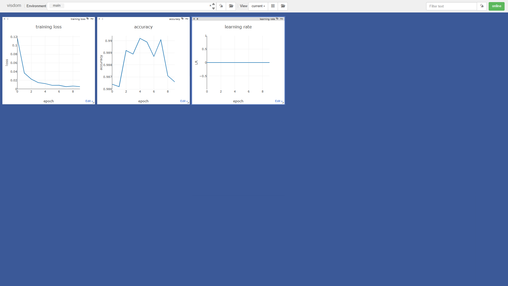
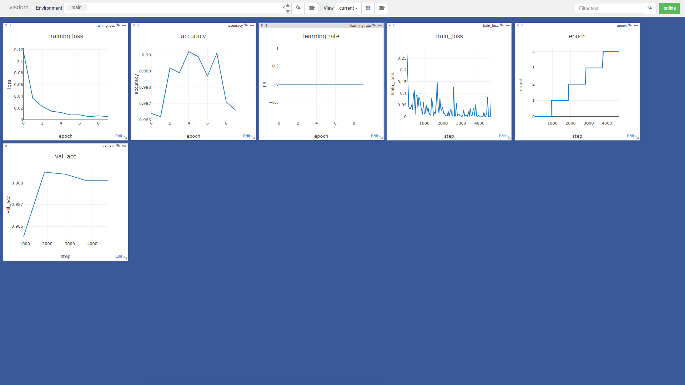
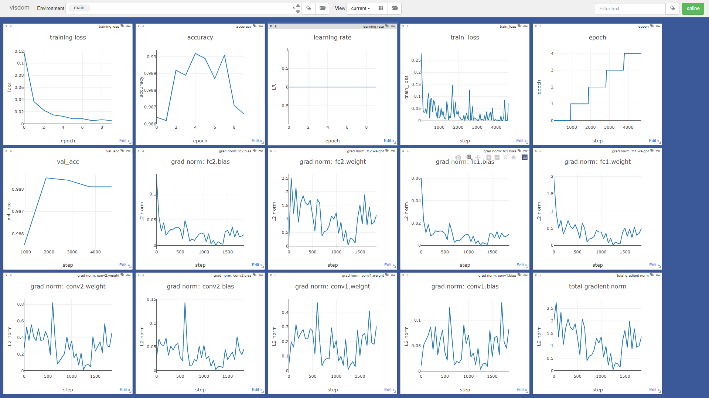

# 🧿 Visdom Logger for PyTorch & PyTorch Lightning

Real-time training visualization for PyTorch Lightning using Visdom, with per-layer gradient norm monitoring via hooks. \ You may want to look at the python notebook first.

## Overview

The project is split into four stages:

1. **Manual training & logging** — Train a simple CNN on MNIST and push loss, accuracy, and learning-rate curves to Visdom by hand (boilerplate code).
2. **Lightning Logger interface exploration** — Inspect the `lightning.pytorch.loggers.Logger` base class to understand the methods a custom logger must implement.
3. **Custom `VisdomLogger`** — Implement a full Lightning-compatible logger that automatically plots every metric logged via `self.log()`, then re-train the same CNN through a `LightningModule` / `Trainer` pipeline.
4. **Hook-based gradient monitoring** — Build a `GradientNormLogger` that attaches backward hooks to every trainable parameter and streams per-layer and total gradient L2-norms to Visdom in real time.

Between stages 3 and 4 there is also a **benchmarking section** that measures the overhead introduced by PyTorch hooks (empty hooks, store-only hooks, sampled-norm hooks, and `.item()` vs no-`.item()` variants).

## Project Structure

```
.
├── model.py                  # SimpleCNN and BigModel definitions
├── data.py                   # MNIST data loading utility
├── train_manual.py           # Stage 1 – manual training loop with Visdom
├── explore_logger.py         # Stage 2 – inspect Lightning Logger interface
├── visdom_logger.py          # Stage 3 – custom VisdomLogger class
├── train_lightning.py        # Stage 3 – Lightning training with VisdomLogger
├── benchmark_hooks.py        # Stage 4 – profile hook overhead
├── gradient_logger.py        # Stage 5 – GradientNormLogger class
├── train_gradient_monitor.py # Stage 5 – training with gradient monitoring
├── images/                   # Dashboard screenshots
│   ├── 1.png
│   ├── 2.png
│   └── 3.png
└── README.md
```

## Requirements

- Python 3.8+
- PyTorch
- torchvision
- [Visdom](https://github.com/fossasia/visdom)
- PyTorch Lightning
- *(Optional)* pyngrok — only needed if you want a public URL for the Visdom dashboard

## Installation

```bash
pip install torch torchvision visdom lightning
# optional, for remote dashboard access:
pip install pyngrok
```

## Usage

Every script that logs to Visdom expects the server to be running first:

```bash
# 1. Start the Visdom server (keep this terminal open)
python -m visdom.server -port 8097

# 2. Open http://localhost:8097 in your browser
```

Then, in a second terminal, run any of the stages:

```bash
# Stage 1 – Manual training loop (10 epochs, plots loss/acc/lr)
python train_manual.py

# Stage 2 – Explore the Lightning Logger interface (prints methods)
python explore_logger.py

# Stage 3 – Train with the custom VisdomLogger via Lightning (5 epochs)
python train_lightning.py

# Stage 4 – Benchmark hook overhead (no Visdom needed)
python benchmark_hooks.py

# Stage 5 – Train with per-layer gradient norm monitoring (2 epochs)
python train_gradient_monitor.py
```

## Dashboard Progression

### Stage 1 — Manual Training Loop

After running `train_manual.py` for 10 epochs, Visdom shows loss, accuracy, and learning rate plotted against epochs:



### Stage 3 — Adding the Lightning Logger

The custom `VisdomLogger` automatically picks up `train_loss`, `val_acc`, and `epoch` from Lightning's `self.log()` calls, adding three new step-level plots alongside the previous ones:



### Stage 5 — Gradient Norm Monitoring

The `GradientNormLogger` hooks into every trainable parameter and streams per-layer L2 gradient norms plus a total norm, completing the full dashboard with 15 plots:



## Model

A lightweight CNN used throughout every experiment:

```
Conv2d(1→32, 3×3) → ReLU
Conv2d(32→64, 3×3) → ReLU → MaxPool2d(2)
Flatten → Linear(9216→128) → ReLU
Linear(128→10)
```

Trained on MNIST with Adam (lr = 1e-3) and CrossEntropyLoss.

## Benchmarking Results

`benchmark_hooks.py` measures hook overhead on a 20-layer `Linear(512→512)` model (500 forward + backward passes). Key findings:

| Variant | Typical Overhead |
|---------|-----------------|
| Empty hooks (just `pass`) | ~1–3 % |
| Store tensor ref only | ~3–5 % |
| `.norm()` every step + `.item()` | ~150–160 % |
| `.norm()` every step, no `.item()` | Significantly lower |
| `.norm()` every 100 steps | Near baseline |

**Takeaway:** avoid `.item()` inside hooks (it forces a GPU sync) and sample at a reasonable interval instead of every step.
